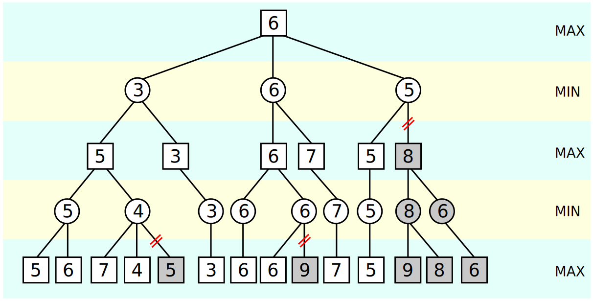

# Documentation

## Project architecture

```bash
├── Makefile
├── main.py
├── setup.cfg
├── setup.py
└── src
    ├── ai/
    ├── models/
    ├── game.py
    ├── index.py
    ├── ui.py
    └── utils.py
```

- `main.py`: is the project entry which initializes the Connect4 app
- `src/`: contains the actual implementation along with some utilities
  - `models/`: defines the models used by the Connect4 app. Ex: `Board` and `Player`.
  - `ai/`: implements the strategy for each AI player.
  - `ui.py`: the user interface implemented with `PyQt5`
  - `game.py`: the connect4 game logic.
  - `index.py`: implements the high level `Connect4` app.
  - `utils.py`: some utilities used through the project.

## AI models

### 1. Alpha-Beta pruning

Alpha–beta pruning is a search algorithm that seeks to decrease the number of nodes that are evaluated by the [minimax algorithm](https://en.wikipedia.org/wiki/Minimax#Minimax_algorithm_with_alternate_moves) in its search tree. It is an adversarial search algorithm used commonly for machine playing of two-player games like Connect4. It stops evaluating a move when at least one possibility has been found that proves the move to be worse than a previously examined move.

Assuming we have 2 players, one wants to maximize his score, while the other wants to minimize his score. This means that:

- if `max_player` score is high, then `min_player` loses.
- if `min_player` score is low, then `max_player` loses.

The initial minimax algorithm search through the tree of all possibilities and returns the best score the player is assured of. The most important component of this algorithm is the `heuristic` that evaluates the current state of game: **Am I loosing ? Is the current configuration favorable to me ?**

Here is an illustration of alpha-beta pruning (source [Wikipedia](https://en.wikipedia.org/wiki/Alpha%E2%80%93beta_pruning#/media/File:AB_pruning.svg "{isExternal}")). The grayed-out subtrees don't need to be explored (when moves are evaluated from left to right), since it is known that the group of subtrees as a whole yields the value of an equivalent subtree or worse, and as such cannot influence the final result. The max and min levels represent the turn of the player and the adversary, respectively.



### 1.1 Discussions around the `Connect4` board evaluation: defining the Heuristic

TODO


### 2. Reinforcement Learning (aka Q-learning)
